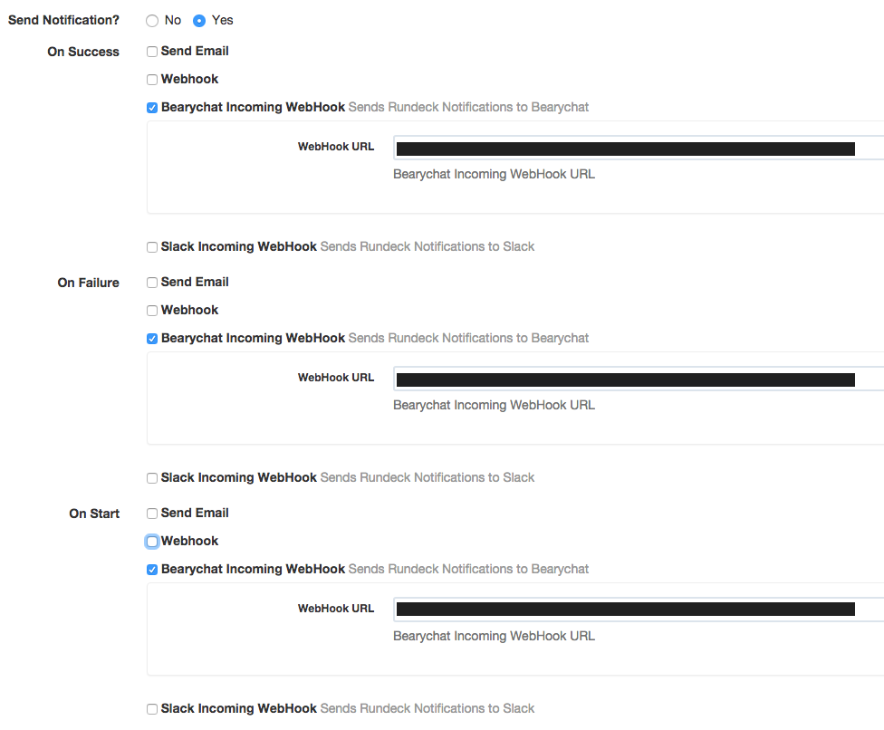

## Rundeck-Bearychat-plugin

Sends Rundeck notification messages to a Bearychat channel. This plugin is based on [rundeck-slack-plugin](https://github.com/higanworks/rundeck-slack-incoming-webhook-plugin).

## Installation Instructions

See the [Included Plugins | Rundeck Documentation](http://rundeck.org/docs/plugins-user-guide/installing.html#included-plugins "Included Plugins") for more information on installing rundeck plugins.

#### Download jarfile

1. Download jarfile from [releases](https://github.com/bearyinnovative/rundeck-bearychat-plugin/releases).
2. copy jarfile to `$RDECK_BASE/libext`

#### Build

1. ```./gradlew clean && ./gradlew build```
2. copy jarfile to `$RDECK_BASE/libext`

## Configuration



The only required configuration settings are:

- `WebHook URL`: Bearychat rundeck-robot webhook url

## Bearychat message example

* on success


* on failure


